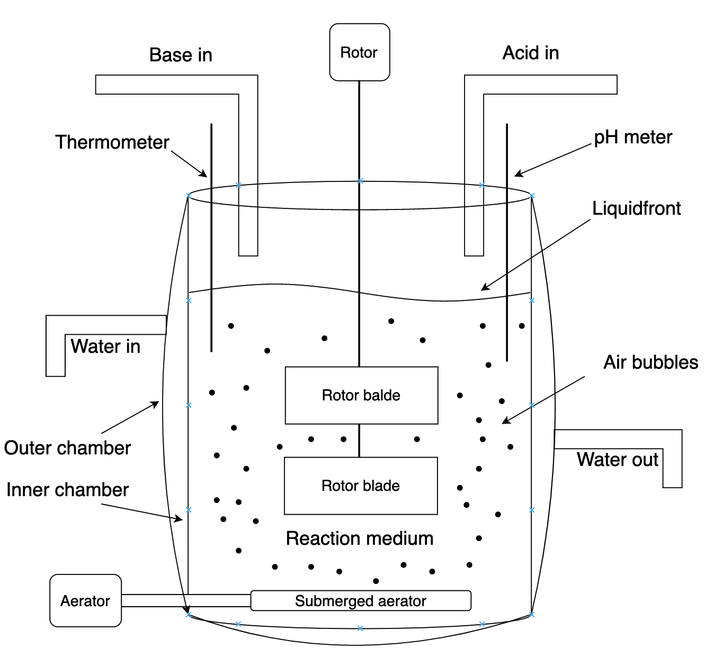

# Solution to controll any fermenter remote via a webapplication

## General idea:

This is a Vite project for my idea to create a basic fermenter controller website, which can control any bioreactor wired to a computer and set to handle the commands from the cloud server.
For the system it doesn't matter how old or new a fermenter is. It is capable to be connected to all kind.
The About needs an off-the-self customisable computer (such as a Raspberry Pi) and some electrical knowledge to wire the computer with the bioreactor. After that the computer will need configuration to be able to communicate with the sensors and actuatros of the bioreactor.
In the future I will create a detailed About manual to help the About with the setup.

## Basics about bioreactors:

A fermenter is a common machine with a few controllers and devices attached to it. Fermenters al also called bioreactors which refers to their purpose. We call a device bioreactor, when inside of them, there is a biologically active environment, in which a chemical process is carried out involving organisms or biochemically active substance. (like enzymes)
The organisms inside of a bioreactor might have special needs. We must provide oxygen; therefore, we use submerged aerators. We need to provide and even distribution in our chamber and for that we mostly use an agitation system. (basically, some kind of rotor in the fluid) There are some examples for fermenters which use the aerator system to create flow inside, but these are used in special scenarios.
Now that we have oxygen provided, organisms can grow and work inside. Every organism has its own thermo and pH optimum where they are the most effective. To maximize their productivity, we need to provide and keep the best conditions for them. To control the pH in the reactor area we can add base or acid to the fluid. Bioreactors commonly use dual layer chambers. Between the layers we can circulate water and with it, we can adjust the temperature in the reaction space.

## System setup theory:

The idea I to have an off-the-self customisable computer (Raspberry Pi 5 is used in the prototypes) wired to a bioreactor and connected to a cloud database. The controll website POST records into the database. The computer uses an event listener in order to detect new records in the database. Once a new record is detected, the software GETs the new state and sets it for the actuator. The method is the same with the sensors except it works to the other way.
To controll the bioreactor I used the GPIO pins on my Raspberry Pi. For the language I choose Python because of the gpiozero library. The website is a React Vite app. The website is connected to the Python codes via a MongoDB database.

## Tools:

- Designed on Apple Macbook Air M1 (2020)
- Tested with Raspberry PI 5 8GB

## Prtototype 1:

...will be updated
