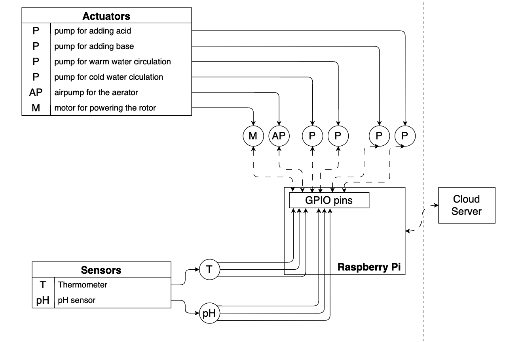

# Hardware aspect of the project

## General

Most bioreactors work the same. They have 5-6 activators for electric motors (for the rotor, the aerator, the fluid circulation and for acid and base intake) and 2 measuring instruments (temperature and pH) to have information about the system. We can add additional instruments as well, like for measuring the purity of the air that goes into the aerator, or measuring the weight throughout the fermentation process. In the first stage of my development, I would like to focus on the basic 5+2 setup and then work on these optional devices. All our devices and sensors need to be heat, corrosion, acid and base resistant.

### Activators

- Rotor: The rotor’s purpose is simple. It needs to create a flow in the fluid to provide a homogenic system. The rotor is powered by an electric motor with can be 1 speed design or an instrument, which can be set to a needed %. The rotor needs 1 GPIO pin on the Raspberry Pi.

- Aerator: The aerator works just like the rotor except its purpose is different. It provides oxygen to the organisms. The aerator needs an air pump (which is basically another electric motor) it can be also an on/off device or an adjustable setup. This needs 1 GPIO pin on Raspberry Pi.

- Water pump: To set the temperature we need; this system circulates water between the 2-wall layer of the reactor. This water is either cold or hot depending on our needs. If we want to warm the reaction chamber we circulate warm water, if we want to cool it, we use cold water. In the first stage I assume there is available warm and cold water. It's easier if we use 2 pumps for the hot and the cold water. These devices need 2 GPIO pins on Raspberry Pi.

- Base and acid pipe: The set the required pH in the fluid we must add base or acid to the system. To do that we need 2 pumps, each able to pump 1 liquid. These can be just simple on/off instruments, here we do not need more specific settings. This part of the system needs 2 GPIO pins on Raspberry Pi.

### Measuring instruments

- Thermometer: The thermometer is a simple device. I need some power and a pin where the sensor can give the Raspberry the current temperature. From the temperature data I can decide whether I need to circulate warm or cold water. This will take 3 pins. A ground pin, a 3.3V pin and GPIO pin. (GPIO 4 recommended)

- pH meter: This sensor is also a simple one. Works the same as the thermometer and gives back live pH value feed to the Raspberry. From its feed we can set control codes for the base and acid pumps. This also will need a ground pin, a 3.3V pin and a GPIO pin.

## Logical blueprint for the hardware setup

## Blueprint for wiring the activators and sersors to the Raspberry Pi

`Coming soon...`
