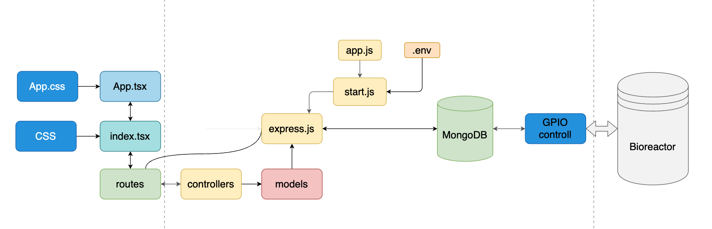

# Software aspect of the project

## General:

The main idea behind the project comes from the fact that most bioreactors in the fermentation industry are in a lack of ability to be controlled remotely. To solve this problem we have a perfect hardware in our hand, which is the Raspberry Pi. Whith a Pi it is relatively easy to hook up the sensors and actuators from an existing bioreactor and controll them. Nowadays software developers focus on building web applications rather then desktop apps, so I decided I would like to do the same with my idea. This new system will be capable to controll any bioreactor with a web based, modern looking and easy to use controller.

## Controller website:

The controller website is written in HTML, CSS and JavaScript. It uses a node.js engine to run the server and a MongoDB database to store the data for the required and current state for the actuators. For the website I use a 3 tier achitecture system.

### Presentation tier:

In the presentation tier I am developing a simple and easy to use degsign with sliders and buttons to controll the atuatros for the reactor. Here I also have to present live data from the sensors. In further will need a user management system to controll, which user can access which part of the database, cause the website is going to run on our side.

### Application tier:

In the application tier we will collect the required setting for the bioreactor and load the current state of the actuators we want into the database. For this purpose I use an express.js server to communicate between the client and the database. The data is loaded into in a form we set in the backend/models folder by the loader code from the backend/controllers folder. The controller script reaches the client in a route we set in the backend/routes folder.

### Data tier:

In the data tier we have a MongoDB cloud based database where we will store the data for the actuator and the data from the sensors. In the reactorState database the system has 2 collections. In the actuatros collection we store the data for the requred setting for the actuators and in the sensors collection we store the data from the thermo and pH sensor.

## Bioreactor controller:

To be able to controll the pins on the Raspberry Pi I use a python application with the GPIOZERO module. The python code has to run locally on the Raspberry Pi which is connected to the bioreactor. To set an actuators the needed setting set on the controller webiste, the python app will use the same MongoDB database as the website. If the customer sets a setting on the website, the data goes to the database and from there the python application will read the change and ajust the setting of the actuator. It will give us a json conformation file, which will be sent to the motor of the website and presented to the customer, letting him/her know, the change in the settings was successful.

## Logical blueprint for the software setup:

